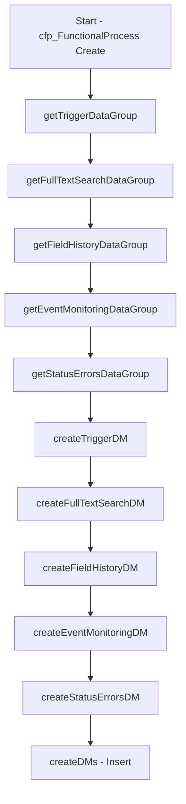

# Flow DataGroup Lookup Refactor + Apex Unit Tests

Replace 5 hardcoded `cfp_DataGroups__c` IDs in `cfp_addDefaultDMsToFuncProcess` with Get Records lookups by Name and System Context, plus add Apex unit tests.

---

## Part 1: Flow Changes

### Current State

The flow [cfp_addDefaultDMsToFuncProcess.flow-meta.xml](src/main/default/flows/cfp_addDefaultDMsToFuncProcess.flow-meta.xml) assigns 5 hardcoded Salesforce IDs to `singleDataMovement.cfp_DataGroups__c`:

| Assignment | Hardcoded ID | DataGroup Name |
|------------|--------------|----------------|
| createTriggerDM | `a8XQE0000006KaL2AU` | trigger |
| createFullTextSearchDM | `a8XQE0000006SmP2AU` | Full Text Search |
| createFieldHistoryDM | `a8XQE0000006Skn2AE` | Field History |
| createEventMonitoringDM | `a8XQE0000006So12AE` | Event Monitoring Logs |
| createStatusErrorsDM | `a8XQE0000006Spd2AE` | status/errors/etc |

**Problem:** IDs are org-specific; deploying to sandbox/production breaks the flow.

### Approach

Use 5 `recordLookup` elements to query `cfp_DataGroups__c` by `Name` and `cfp_System_Context__r.Name = "Salesforce Platform Features"`. Each lookup uses `getFirstRecordOnly=true` and `storeOutputAutomatically=true`; the element name becomes the output variable (e.g. `getTriggerDataGroup.Id`).

### 1. Add 5 recordLookup Elements

Insert after `<start>` and before the first assignment. Execution chain: **Start → getTriggerDataGroup → getFullTextSearchDataGroup → getFieldHistoryDataGroup → getEventMonitoringDataGroup → getStatusErrorsDataGroup → createTriggerDM** (existing chain).

Each `recordLookup`:

- **object:** `cfp_DataGroups__c`
- **filters:** (both required, `filterLogic` = `and`)
  - `Name` `EqualTo` `"<Name>"` (exact string)
  - `cfp_System_Context__r.Name` `EqualTo` `"Salesforce Platform Features"`
- **getFirstRecordOnly:** `true`
- **storeOutputAutomatically:** `true`
- **assignNullValuesIfNoRecordsFound:** `false`

| Element name | Filter value |
|--------------|--------------|
| getTriggerDataGroup | trigger |
| getFullTextSearchDataGroup | Full Text Search |
| getFieldHistoryDataGroup | Field History |
| getEventMonitoringDataGroup | Event Monitoring Logs |
| getStatusErrorsDataGroup | status/errors/etc |

**Example metadata** (getTriggerDataGroup):

```xml
<recordLookups>
    <name>getTriggerDataGroup</name>
    <label>getTriggerDataGroup</label>
    <locationX>176</locationX>
    <locationY>134</locationY>
    <assignNullValuesIfNoRecordsFound>false</assignNullValuesIfNoRecordsFound>
    <connector>
        <targetReference>getFullTextSearchDataGroup</targetReference>
    </connector>
    <filterLogic>and</filterLogic>
    <filters>
        <field>Name</field>
        <operator>EqualTo</operator>
        <value>
            <stringValue>trigger</stringValue>
        </value>
    </filters>
    <filters>
        <field>cfp_System_Context__r.Name</field>
        <operator>EqualTo</operator>
        <value>
            <stringValue>Salesforce Platform Features</stringValue>
        </value>
    </filters>
    <getFirstRecordOnly>true</getFirstRecordOnly>
    <object>cfp_DataGroups__c</object>
    <storeOutputAutomatically>true</storeOutputAutomatically>
</recordLookups>
```

### 2. Update start Connector

Change start connector from `createTriggerDM` to `getTriggerDataGroup`:

```xml
<start>
    ...
    <connector>
        <targetReference>getTriggerDataGroup</targetReference>
    </connector>
    ...
</start>
```

### 3. Update getStatusErrorsDataGroup Connector

Point the last lookup to the first assignment:

```xml
<connector>
    <targetReference>createTriggerDM</targetReference>
</connector>
```

### 4. Replace Hardcoded Values in Assignments

Replace each `<stringValue>a8XQE...</stringValue>` with `<elementReference>` to the corresponding lookup output:

| Assignment | Replace with |
|------------|--------------|
| createTriggerDM | `getTriggerDataGroup.Id` |
| createFullTextSearchDM | `getFullTextSearchDataGroup.Id` |
| createFieldHistoryDM | `getFieldHistoryDataGroup.Id` |
| createEventMonitoringDM | `getEventMonitoringDataGroup.Id` |
| createStatusErrorsDM | `getStatusErrorsDataGroup.Id` |

**Before:**
```xml
<assignToReference>singleDataMovement.cfp_DataGroups__c</assignToReference>
<operator>Assign</operator>
<value>
    <stringValue>a8XQE0000006KaL2AU</stringValue>
</value>
```

**After:**
```xml
<assignToReference>singleDataMovement.cfp_DataGroups__c</assignToReference>
<operator>Assign</operator>
<value>
    <elementReference>getTriggerDataGroup.Id</elementReference>
</value>
```

### Execution Flow (After Changes)



### Flow Prerequisites and Risks

- **System Context "Salesforce Platform Features"** must exist. The 5 DataGroups must be associated with this System Context (cfp_System_Context__c lookup).
- **DataGroups must exist** with these exact Names under that context: `trigger`, `Full Text Search`, `Field History`, `Event Monitoring Logs`, `status/errors/etc`. If any are missing, the flow will fault.
- **Data setup:** Ensure the 5 default DataGroups are created under the "Salesforce Platform Features" System Context before deploying. (Current CSV shows these DataGroups with `#N/A` for System Context—they must be associated with "Salesforce Platform Features" for the lookups to succeed.)
- **SOQL:** 5 extra Get Records per Functional Process create. Acceptable for a record-triggered flow.

---

## Part 2: Apex Unit Tests

### Test Strategy

The flow is record-triggered (runs on `cfp_FunctionalProcess__c` Create). Tests must:

1. Create the required test data (System Context, DataGroups)
2. Insert a `cfp_FunctionalProcess__c` to trigger the flow
3. Query the resulting `cfp_Data_Movements__c` records and assert expected values

### Test Data Requirements

| Object | Fields | Purpose |
|--------|--------|---------|
| cfp_System_Context__c | Name = "Salesforce Platform Features" | Scope for DataGroup lookups |
| cfp_DataGroups__c (×5) | Name, cfp_System_Context__c | Must match flow lookup criteria |

**DataGroup Names** (exact): `trigger`, `Full Text Search`, `Field History`, `Event Monitoring Logs`, `status/errors/etc`

### Update Existing `cfp_DataMovementsOrderingTest` @TestSetup

The existing test class creates only a Functional Process. All tests assume 5 default DMs exist. **After the flow change, the flow will fail** unless the 5 DataGroups exist under "Salesforce Platform Features".

**Required change to `@TestSetup`:**

```apex
@TestSetup
static void setup() {
    // 1. Create System Context
    cfp_System_Context__c sysCtx = new cfp_System_Context__c(
        Name = 'Salesforce Platform Features'
    );
    insert sysCtx;

    // 2. Create 5 DataGroups under that context
    List<cfp_DataGroups__c> dgs = new List<cfp_DataGroups__c>{
        new cfp_DataGroups__c(Name = 'trigger', cfp_System_Context__c = sysCtx.Id),
        new cfp_DataGroups__c(Name = 'Full Text Search', cfp_System_Context__c = sysCtx.Id),
        new cfp_DataGroups__c(Name = 'Field History', cfp_System_Context__c = sysCtx.Id),
        new cfp_DataGroups__c(Name = 'Event Monitoring Logs', cfp_System_Context__c = sysCtx.Id),
        new cfp_DataGroups__c(Name = 'status/errors/etc', cfp_System_Context__c = sysCtx.Id)
    };
    insert dgs;

    // 3. Create FP (triggers flow - creates 5 default DMs)
    cfp_FunctionalProcess__c fp = new cfp_FunctionalProcess__c(Name = 'Test FP');
    insert fp;
}
```

### New Test Class `cfp_addDefaultDMsToFuncProcessTest`

Dedicated test class for the flow. Keeps flow tests isolated.

**Test methods:**

| Method | Purpose |
|--------|---------|
| `testDefaultDMsCreatedWithCorrectDataGroups` | Create System Context + 5 DataGroups + FP. Assert 5 DMs created; each DM's `cfp_DataGroups__c` matches the expected DataGroup Id (by Name). |
| `testDefaultDMsHaveCorrectNamesAndOrder` | Assert DM Names and `cfp_order__c`: trigger (1), Full Text (96), Field History (97), Event Monitoring (98), status/errors (99). |
| `testDefaultDMsHaveCorrectMovementTypesAndImplementation` | Assert `cfp_movementtype__c` and `cfp_implementationtype__c`: trigger=E/tbd; FullText/FieldHistory/EventMonitoring=W/ootb; status/errors=X/tbd. |
| `testDefaultDMsLinkedToFunctionalProcess` | Assert all 5 DMs have `cfp_FunctionalProcess__c` = inserted FP Id. |

**Helper:** `createDefaultDataGroupsSetup()` — creates System Context + 5 DataGroups, returns `Map<String, Id>` (Name → DataGroup Id) for assertions.

### Assertion Matrix

| DM Name | cfp_order__c | cfp_movementtype__c | cfp_implementationtype__c | cfp_DataGroups__r.Name |
|---------|--------------|----------------------|---------------------------|------------------------|
| Enter description of triggering Event | 1 | E | tbd | trigger |
| write to Full Text Index | 96 | W | ootb | Full Text Search |
| write to Field History | 97 | W | ootb | Field History |
| write to Event Monitoring Logs | 98 | W | ootb | Event Monitoring Logs |
| status/errors/etc | 99 | X | tbd | status/errors/etc |

**Query for assertions:**

```apex
List<cfp_Data_Movements__c> dms = [
    SELECT Name, cfp_order__c, cfp_movementtype__c, cfp_implementationtype__c,
           cfp_DataGroups__c, cfp_DataGroups__r.Name, cfp_FunctionalProcess__c
    FROM cfp_Data_Movements__c
    WHERE cfp_FunctionalProcess__c = :fp.Id
    ORDER BY cfp_order__c ASC
];
```

### Negative Test (Optional)

| Method | Purpose |
|--------|---------|
| `testFlowFaultsWhenDataGroupsMissing` | Create FP **without** creating DataGroups. Expect flow to fault (no DMs created). Consider skipping if assertion is unreliable. |

### Test Execution Order

1. `@TestSetup` runs first (creates System Context, DataGroups, FP).
2. Flow runs on FP insert → creates 5 default DMs.
3. Each test method runs in its own transaction with access to `@TestSetup` data.
4. Tests that insert additional FP (e.g. `testInsertingMultipleProcessWithMultipleSteps`) will also trigger the flow for the new FP; ensure DataGroups exist for that flow run.

---

## Files to Create/Modify

| File | Action |
|------|--------|
| [src/main/default/flows/cfp_addDefaultDMsToFuncProcess.flow-meta.xml](src/main/default/flows/cfp_addDefaultDMsToFuncProcess.flow-meta.xml) | **Modify** — add 5 recordLookups, update start connector, replace 5 hardcoded IDs |
| [src/main/default/classes/cfp_addDefaultDMsToFuncProcessTest.cls](src/main/default/classes/cfp_addDefaultDMsToFuncProcessTest.cls) | **Create** — new test class with 4 test methods |
| [src/main/default/classes/cfp_addDefaultDMsToFuncProcessTest.cls-meta.xml](src/main/default/classes/cfp_addDefaultDMsToFuncProcessTest.cls-meta.xml) | **Create** — meta for new class |
| [src/main/default/classes/cfp_DataMovementsOrderingTest.cls](src/main/default/classes/cfp_DataMovementsOrderingTest.cls) | **Modify** — `@TestSetup` to add System Context + 5 DataGroups |
