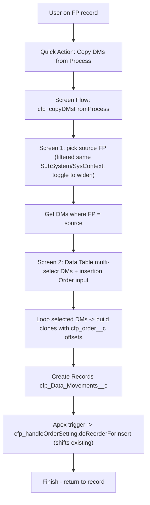

## Goal

User on a `cfp_FunctionalProcess__c` record clicks an action, picks a source process (default-filtered to same Sub System / System Context, override allowed), multi-selects Data Movements via a Data Table, picks insertion `cfp_order__c`, and cloned DMs appear at that position. Existing `cfp_handleOrderSetting` shifts everything else down.

## Architecture

## Files to add

- `src/main/default/flows/cfp_copyDMsFromProcess.flow-meta.xml` - new Screen Flow, `processType=Flow`, input var `recordId` (current FP).
- `src/main/default/quickActions/cfp_FunctionalProcess__c.cfp_Copy_DMs_from_Process.quickAction-meta.xml` - Lightning quick action launching the flow with `recordId` passed in.
- Update `src/main/default/flexipages/cfp_FunctionalProcess_Record_Page.flexipage-meta.xml` highlightsPanel `actionNames` list to include `cfp_FunctionalProcess__c.cfp_Copy_DMs_from_Process` (next to existing `Create_CRUDL` etc. around lines 443-450).
- Update `src/main/default/permissionsets/cfp_CosmicWorkbench.permissionset-meta.xml` to grant the flow + quick action.

## Flow structure (`cfp_copyDMsFromProcess`)

1. **Get current FP** - lookup `cfp_FunctionalProcess__c` by `recordId` to read `cfp_System_Context__c` + `cfp_Sub_System__c`.
2. **Screen 1 - pick source process**:
   - Lookup component for `cfp_FunctionalProcess__c` filtered `Id != recordId AND cfp_System_Context__c = {!currentFP.cfp_System_Context__c} AND cfp_Sub_System__c = {!currentFP.cfp_Sub_System__c}`.
   - Checkbox "Widen search to all processes in System Context" -> branch lookup with relaxed filter.
   - Number input `insertionOrder` (default = current max DM order + 1; precomputed via Get Records `MAX cfp_order__c` then assignment).
3. **Get source DMs** - `cfp_Data_Movements__c WHERE cfp_FunctionalProcess__c = sourceFP.Id AND cfp_order__c < 90` ordered by `cfp_order__c` (skip default 90+ slot DMs to mirror `createMapFromExistingSteps` line 283).
4. **Screen 2 - select DMs** - Data Table component (`flowruntime:dataTable`) bound to source DMs collection, mode `multi`, columns: Name, `cfp_movementtype__c`, `cfp_DataGroups__c` (display name via formula), `cfp_implementationtype__c`, `cfp_order__c`, `cfp_comments__c`. Output: `selectedDMs` collection.
5. **Loop + Assignment** - iterate `selectedDMs`, build a new `cfp_Data_Movements__c` per source row:
   - Carry over: `Name`, `cfp_movementtype__c`, `cfp_implementationtype__c`, `cfp_DataGroups__c`, `cfp_artifactName__c`, `cfp_comments__c`, `cfp_Implemenation_Category__c`, `cfp_is_API_Call__c`, `cfp_isOOTB__c`/`isConfig`/`isLowCode`/`isProCode` (formula/auto if applicable - skip if not writable).
   - Set `cfp_FunctionalProcess__c = recordId`.
   - Set `cfp_order__c = insertionOrder + loopIndex` (use a counter var incremented in the loop).
   - Add to `dmsToInsert` collection.
6. **Create Records** `dmsToInsert`. Trigger framework (`cfp_handleOrderSetting.doReorderForInsert`) handles shifting any existing DMs whose order >= insertion point. No special collision handling needed - existing logic at lines 187-194 inserts at `cfp_order__c - 1` index then re-stamps sequentially.
7. **Finish** - "Done" screen, no navigation override (returns to FP record).

## Key decisions / notes

- **No Apex needed.** Reuse existing trigger reorder behaviour. If trigger isn't already wired to fire on these inserts, verify with `cfp_DataMovementsOrderingTest` and existing trigger file (search `Data_Movement` triggers - none currently in repo per `**/triggers/*Data_Movement*` glob; `cfp_handleOrderSetting` is invoked from somewhere - must confirm during implementation, may already be Flow-invoked or via process builder; if no live insert hook exists, add a simple before-insert trigger calling `doReorderForInsert`).
- **Reused-flag approach** explicitly rejected per user choice (`clone`), so do NOT set `cfp_is_reUsed__c` / `cfp_Reused_Functional_Step__c` on the new records.
- **Default-step exclusion**: source query filters `cfp_order__c < 90` so the four default OOTB tail steps (orders 96-99) aren't surfaced as candidates - matches existing convention.
- **Bulk safety**: clone count usually small; flow loop is fine. No SOQL inside loop.

## Testing

- Manual: open FP record, click quick action, verify default same-subsystem filter, multi-select 3 DMs, set insertion order to 2 on a target with 5 existing DMs, confirm new DMs land at orders 2/3/4 and originals shift to 5/6/7/8.
- Re-run `cfp_DataMovementsOrderingTest` to confirm insert-at-position path still passes.

## Open item to confirm during build

Whether a trigger on `cfp_Data_Movements__c` currently invokes `cfp_handleOrderSetting.doReorderForInsert`. Glob found `cfp_DataMovementsOrderingTest.cls` but no `triggers/` file - must inspect class for how it sets up DML and add a trigger if missing (one-line `before insert` -> `cfp_handleOrderSetting.doReorderForInsert(Trigger.new);`).
