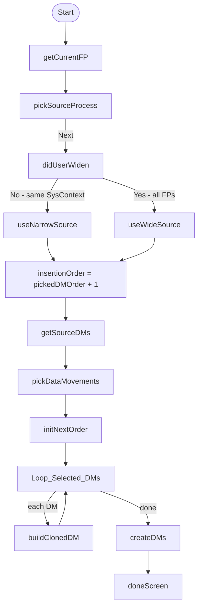

# Copy DMs Flow - Simplify Source Picker & Insertion Order Combo

## Files to change

- [`src/main/default/flows/cfp_copyDMsFromProcess.flow-meta.xml`](src/main/default/flows/cfp_copyDMsFromProcess.flow-meta.xml)
- New: `src/main/default/objects/cfp_Data_Movements__c/fields/cfp_DM_OrderDisplay__c.field-meta.xml`

---

## Change 1: Single searchable FP picker (no Sub System section)

**Current:** Two `RadioButtons` fields — `sourceFP` (sub-system filter) and `sourceFPWidened` (sys-context filter) — plus a `widenSearch` checkbox to toggle between them.

**New behaviour:**
- Default: same System Context (`cfp_System_Context__c` filter only, no sub-system filter)
- Widened: all FPs in org (no filters except exclude current record)

**What changes in the flow XML:**

1. Remove `dynamicChoiceSet` `sourceFPChoicesSubSystem` (sub-system filtered one)
2. Rename `sourceFPChoicesSysContext` → keep as the default (same sys context); add a second `dynamicChoiceSet` `sourceFPChoicesAll` with only the `Id != recordId` filter
3. On `pickSourceProcess` screen:
   - Remove `sourceFP` RadioButtons field
   - Change `sourceFPWidened` field from `RadioButtons` → `DropdownBox` (gives combo/search UX), rename to `sourceFP` to reuse downstream references
   - Update label: `Source Functional Process`
   - Update instructions text to reflect new behaviour
4. Decision `didUserWiden`:
   - `Yes` branch → `useWideSource` (assigns `sourceFPChoicesAll` value to `chosenSourceFP`)
   - `No` branch → `useNarrowSource` (assigns `sourceFPChoicesSysContext` value)
5. Remove `useNarrowSource`/`useWideSource` assignments (they just copied `sourceFP`/`sourceFPWidened` to `chosenSourceFP`) — instead, make the decision read from the single `sourceFP` field directly, or keep assignments pointing at the same `sourceFP` variable

---

## Change 2: Insertion order as searchable combo of target DMs

**Problem:** `dynamicChoiceSet` `displayField` is a single field. To show `"3 - Step Name"` requires a formula field.

**New formula field** on `cfp_Data_Movements__c`:
```xml
<CustomField>
    <fullName>cfp_DM_OrderDisplay__c</fullName>
    <label>DM Order Display</label>
    <formula>TEXT(cfp_order__c) &amp; &quot; - &quot; &amp; Name</formula>
    <formulaTreatBlanksAs>BlankAsZero</formulaTreatBlanksAs>
    <type>Text</type>
</CustomField>
```

**New `dynamicChoiceSet`** `targetDMChoices` in the flow:
- `object`: `cfp_Data_Movements__c`
- `displayField`: `cfp_DM_OrderDisplay__c`
- `valueField`: `cfp_order__c` (Number — captures the order of the chosen DM)
- Filter: `cfp_FunctionalProcess__c = recordId` AND `cfp_order__c < 90`
- Sort: `cfp_order__c Asc`

**Screen change** on `pickSourceProcess`:
- Replace `insertionOrder` `InputField` (Number) with a `DropdownBox` using `targetDMChoices`
- The picked value = the `cfp_order__c` of the DM the user wants to insert *after*
- Add an assignment after the screen (or inline formula) to set `insertionOrder = pickedDM_order + 1`

**Variable:** Keep `insertionOrder` as Number, it feeds into `initNextOrder` → `nextOrder` unchanged downstream.

---

## Flow diagram (after changes)


